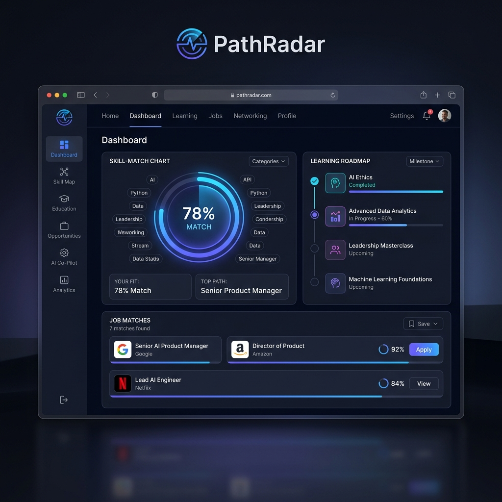
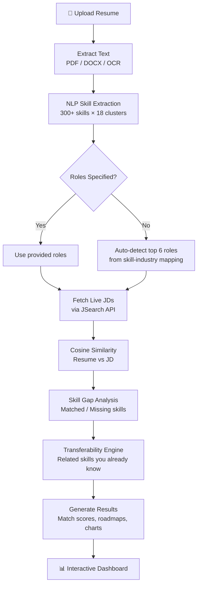

<p align="center">
  
</p>

<h1 align="center">🧭 PathRadar — AI Resume Skill Gap Analyzer</h1>

<p align="center">
  <strong>Upload your resume. Discover your skill gaps. Get a personalized roadmap to your dream career.</strong>
</p>

<p align="center">
  
  
  
  
  
</p>

---

## 📖 What is PathRadar?

PathRadar is a full-stack **AI-powered career intelligence platform** that analyzes your resume against **live job market data** to identify skill gaps and generate personalized learning roadmaps.

Unlike simple keyword-matching tools, PathRadar uses **NLP-based semantic analysis** to understand the context of your experience, maps your skills across **13+ industries** and **80+ job roles**, fetches **real-time job descriptions** from platforms like LinkedIn and Indeed, and provides **curated video tutorials** to bridge every gap.

### 🎯 Who is this for?

- **Job seekers** who want to know exactly what skills they need for their target role
- **Career switchers** exploring which industries their current skills transfer to
- **Students & fresh grads** looking for a data-driven career roadmap
- **Professionals** wanting to stay ahead of market trends

---

## ✨ Key Features

| Feature | Description |
|---|---|
| 🧠 **Semantic Skill Extraction** | NLP engine extracts skills from resumes (PDF, DOCX, DOC, PNG, JPG, TXT) using regex + contextual matching across 300+ skills |
| 🌐 **Live Job Market Integration** | Fetches real-time job descriptions via [JSearch API](https://rapidapi.com/letscrape-6bRBa3QguO5/api/jsearch) (LinkedIn, Indeed, Glassdoor) |
| 📊 **Multi-Role Analysis** | Compares your resume against up to 6 roles simultaneously with per-role match scores |
| 🔄 **Skill Transferability Engine** | Shows which of your current skills can fast-track learning new ones (e.g., knowing React → easy to learn Vue) |
| 🗺️ **Personalized Learning Roadmaps** | Curated video tutorials via YouTube Data API + links to Coursera, Udemy, freeCodeCamp |
| 📈 **Interactive Dashboards** | Chart.js pie charts for skill cluster distribution + Matplotlib-generated server-side charts |
| 🏭 **Industry Detection** | Auto-detects your best-fit industries across 13 sectors (Software, Healthcare, Finance, etc.) |
| 🔐 **User Authentication** | Email/password auth with session persistence + guest mode for quick one-time analysis |
| 📁 **Analysis History** | Logged-in users can save and revisit past analyses |
| 🎯 **Smart Job Matching** | Filters roles by a 70% match threshold and links directly to job application pages |

---

## 🏗️ Architecture Overview

```
PathRadar/
├── backend/                    # Flask API Server
│   ├── app.py                  # Main Flask app — all API routes & auth
│   ├── model.py                # NLP engine, skill extraction, analysis logic
│   ├── job_fetcher.py          # JSearch API integration (live job data)
│   ├── course_fetcher.py       # YouTube Data API + learning resource links
│   ├── dashboard_generator.py  # Matplotlib chart generation
│   ├── test_api.py             # API endpoint tests
│   ├── test_workflow.py        # End-to-end workflow tests
│   ├── requirements.txt        # Python dependencies
│   └── .env                    # API keys (RAPIDAPI_KEY, YOUTUBE_API_KEY)
│
├── frontend/                   # Vanilla JS + CSS Frontend
│   ├── index.html              # Single-page app with multi-screen navigation
│   ├── app.js                  # All frontend logic — auth, upload, rendering
│   ├── styles.css              # Premium dark-themed UI with glassmorphism
│   └── pathradar_preview.png   # App preview image
│
├── uploads/                    # Uploaded resume files (auto-created)
├── database.db                 # SQLite database (users, sessions, results)
├── Procfile                    # Heroku/deployment config
└── README.md                   # You are here!
```

---

## 🔧 Tech Stack

### Backend
| Technology | Purpose |
|---|---|
| **Flask** | REST API framework |
| **SQLite** | Lightweight database for users, sessions, and results |
| **pdfplumber** | PDF text extraction |
| **pytesseract + Pillow** | OCR for image-based resumes (PNG/JPG) |
| **python-docx** | DOCX text extraction |
| **Matplotlib** | Server-side chart generation |
| **Requests** | HTTP client for external API calls |
| **Werkzeug** | Password hashing, secure file handling |
| **itsdangerous** | Bearer token generation/validation |

### Frontend
| Technology | Purpose |
|---|---|
| **Vanilla JavaScript (ES6+)** | SPA logic, API calls, DOM rendering |
| **Vanilla CSS** | Dark-themed glassmorphism UI |
| **Chart.js** | Interactive pie charts for skill distribution |
| **Google Fonts (Inter, Outfit)** | Premium typography |

### External APIs
| API | Purpose | Free Tier |
|---|---|---|
| **JSearch API** (RapidAPI) | Real-time job listings from LinkedIn, Indeed, etc. | 200 requests/month |
| **YouTube Data API v3** | Curated tutorial video links | 10,000 quota units/day (~100 searches) |

---

## 🚀 Getting Started

### Prerequisites

- **Python 3.9+** installed
- **pip** (Python package manager)
- **Tesseract OCR** (optional — only needed for image-based resumes)
  - Windows: [Download installer](https://github.com/UB-Mannheim/tesseract/wiki)
  - Mac: `brew install tesseract`
  - Linux: `sudo apt install tesseract-ocr`

### 1. Clone the Repository

```bash
git clone https://github.com/ShreevatsaNJ/PathRadar.git
cd PathRadar
```

### 2. Install Python Dependencies

```bash
pip install -r backend/requirements.txt
```

### 3. Configure API Keys

Create or edit the file `backend/.env`:

```env
# JSearch API Key from RapidAPI (required for live job data)
# Get yours at: https://rapidapi.com/letscrape-6bRBa3QguO5/api/jsearch
RAPIDAPI_KEY=your_rapidapi_key_here

# YouTube Data API v3 Key (optional but recommended for video tutorials)
# Get yours at: https://console.cloud.google.com/apis/library/youtube.googleapis.com
YOUTUBE_API_KEY=your_youtube_api_key_here
```

> **Note:** The app works without API keys but will not fetch live job data or YouTube tutorials. It will fall back to curated video links and search-page URLs.

### 4. Run the Application

```bash
cd backend
python app.py
```

The server starts at **http://localhost:5000**.

### 5. Open in Browser

Navigate to **http://localhost:5000** — the Flask server serves the frontend automatically.

---

## 📡 API Reference

All endpoints are prefixed with `/api`.

### Authentication

| Method | Endpoint | Description |
|---|---|---|
| `POST` | `/api/signup` | Register a new user (`email`, `password`, `full_name`) |
| `POST` | `/api/login` | Login and receive a Bearer token |
| `POST` | `/api/logout` | Clear the user session |
| `GET` | `/api/user` | Get the currently logged-in user |

### Resume Analysis

| Method | Endpoint | Description |
|---|---|---|
| `POST` | `/api/analyze` | Upload resume + optional `roles` and `location`. Returns multi-role analysis with skill gaps, match scores, and job listings. |
| `POST` | `/api/analyze-industry` | Upload resume + optional `industries`. Analyzes across entire industries with auto-role mapping. |
| `POST` | `/api/suggest-roles` | Upload resume to auto-detect best-fit roles and industries (no API calls — pure NLP). |

### Results & History

| Method | Endpoint | Description |
|---|---|---|
| `GET` | `/api/result/<session_id>` | Fetch complete analysis results for a session |
| `GET` | `/api/skill-clusters/<session_id>` | Get skill clustering breakdown for a session |
| `GET` | `/api/transferability/<session_id>` | Get skill transferability data for all roles in a session |
| `GET` | `/api/dashboard` | Fetch all past analysis sessions (requires auth) |
| `POST` | `/api/claim-session` | Link a guest analysis session to a logged-in account |

### Utilities

| Method | Endpoint | Description |
|---|---|---|
| `GET` | `/api/fetch-jobs?role=...&location=...` | Preview live job listings for a role |
| `GET` | `/api/industry-skills` | List all industries and their required skill clusters |
| `GET` | `/api/course-links?skill=...` | Get learning resources (YouTube, Coursera, Udemy) for a skill |
| `GET` | `/api/learning-path/<session_id>/<role>` | Get a structured learning roadmap for missing skills |
| `GET` | `/api/charts/<session_id>` | Generate Matplotlib dashboard charts |

---

## 🧠 How the Analysis Engine Works



### Scoring Formula

The match score for each role is calculated as:

```
Final Score = (AI Semantic Similarity × 0.4) + (Skill Match % × 0.6)
```

- **AI Semantic Similarity**: Cosine similarity between resume text and combined job descriptions (TF-based)
- **Skill Match %**: `(matched_skills / total_jd_skills) × 100`

### Skill Clusters (18 Categories)

| Cluster | Example Skills |
|---|---|
| Programming Languages | Python, Java, JavaScript, Go, Rust |
| Web Frontend | React, Angular, Vue, CSS, Figma |
| Web Backend | Node.js, Django, Flask, FastAPI |
| Cloud & DevOps | AWS, Docker, Kubernetes, Terraform |
| Data & Analytics | SQL, Pandas, Power BI, Tableau |
| AI & Machine Learning | TensorFlow, PyTorch, NLP, Computer Vision |
| Cybersecurity | Penetration Testing, SIEM, Encryption |
| Management & Leadership | Agile, Scrum, Project Management, PMP |
| Marketing & Digital | SEO, SEM, Content Marketing, Google Ads |
| Sales & Business | Negotiation, CRM, Salesforce, B2B |
| Finance & Accounting | Financial Modeling, Auditing, SAP, GST |
| Healthcare & Medical | Patient Care, HIPAA, Clinical Research |
| Teaching & Education | Curriculum Development, E-Learning |
| Culinary & Food | HACCP, Menu Planning, Food Safety |
| Hospitality & Hotel | Front Desk, Event Planning, Concierge |
| Logistics & Delivery | Supply Chain, Warehouse, Fleet Management |
| Mechanical & Engineering | CAD, SolidWorks, CNC, Robotics |
| Soft Skills | Communication, Leadership, Problem Solving |

### Supported Industries (13)

Software/IT · Data & Analytics · Marketing · Sales · Finance · Healthcare · Teaching · Cooking/Chef · Hotel/Hospitality · Delivery/Logistics · Mechanical/Engineering · Cybersecurity · Management

---

## 🖥️ User Flow

```
Landing Page → Get Started → Login / Sign Up / Guest
                                    ↓
                              Upload Resume
                                    ↓
                            AI Analysis Running
                              (progress bar)
                                    ↓
                          ┌─────────────────────┐
                          │  Results Dashboard   │
                          │                      │
                          │  • Match Score        │
                          │  • Skill Clusters     │
                          │  • Role Cards         │
                          │  • Industry Fit       │
                          │  • Learning Roadmap   │
                          │  • Job Listings       │
                          └─────────────────────┘
                                    ↓
                    Click any role → Detailed breakdown
                    Click missing skill → Video tutorial
```

---

## 🧪 Running Tests

```bash
cd backend

# Test API endpoints
python test_api.py

# Test full analysis workflow
python test_workflow.py
```

---

## 📦 Deployment

### Heroku (Procfile included)

```bash
heroku create pathradar
heroku config:set RAPIDAPI_KEY=your_key YOUTUBE_API_KEY=your_key
git push heroku main
```

### Docker (Manual)

```dockerfile
FROM python:3.11-slim
WORKDIR /app
COPY . .
RUN pip install -r backend/requirements.txt
EXPOSE 5000
CMD ["gunicorn", "backend.app:app", "--bind", "0.0.0.0:5000"]
```

---

## 🤝 Contributing

1. Fork the repository
2. Create a feature branch (`git checkout -b feature/amazing-feature`)
3. Commit your changes (`git commit -m 'Add amazing feature'`)
4. Push to the branch (`git push origin feature/amazing-feature`)
5. Open a Pull Request

---

## 📜 License

This project is open source and available under the [MIT License](LICENSE).

---

## 🙏 Acknowledgements

- **JSearch API** by LetsC scrape (RapidAPI) — Real-time job data aggregation
- **YouTube Data API v3** — Tutorial video discovery
- **freeCodeCamp** — Curated video course links for 100+ skills
- **Chart.js** — Interactive frontend visualizations
- **Matplotlib** — Server-side dashboard generation

---

<p align="center">
  Built with ❤️ by <strong>Shreevatsa NJ</strong>
</p>
